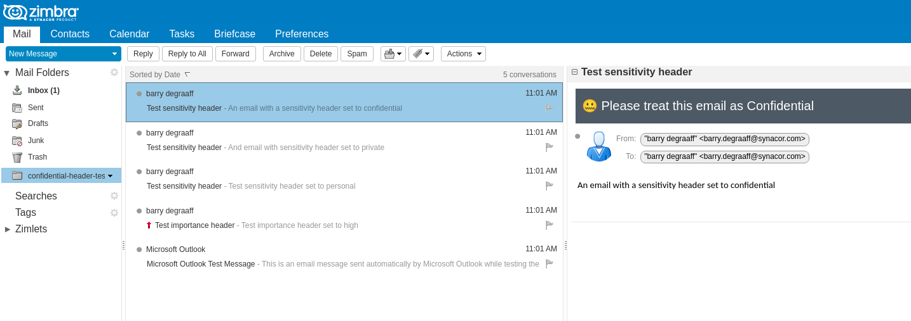
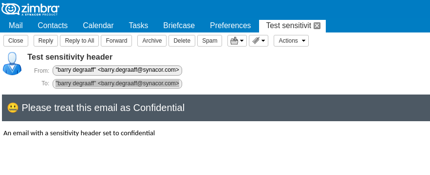
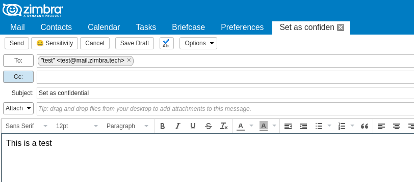
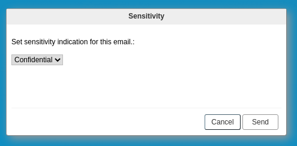
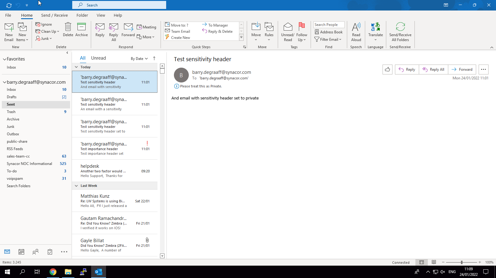
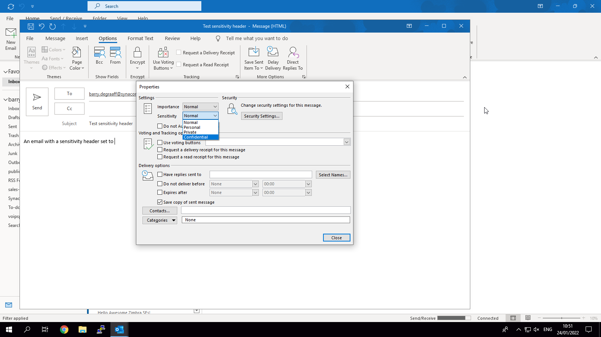

# Confidential header Zimlet

This Classic UI Zimlet implements the reading and setting of the Sensitivity header RFC2156, it is implemented the same way as in MS Outlook, mainly to keep it consistent.

For the Modern UI version take a look at [TLP Zimlet](https://github.com/Zimbra/zimbra-zimlet-tlp).

## Configuring Zimbra

To allow the setting of the Sensitivity header one must enable it on the Zimbra server:

```
zmprov mcf +zimbraCustomMimeHeaderNameAllowed Sensitivity
```

## Screenshots

> 
*Display of the Sensitivity header in Zimbra*

> 
*Display of the Sensitivity header in Zimbra*

> 
*The Sensitivity button in the email composer*

> 
*The Sensitivity Zimlet Dialog*

> 
*Display of the Sensitivity header in MS Outlook*

> 
*Setting the Sensitivity header in MS Outlook*

## Further reading

- https://github.com/Zimbra/confidential-header-zimlet
- https://www.rfc-editor.org/rfc/rfc2156#section-5.3.4
- https://gallery.zetalliance.org/extend/items/view/confidential-header-zimlet
